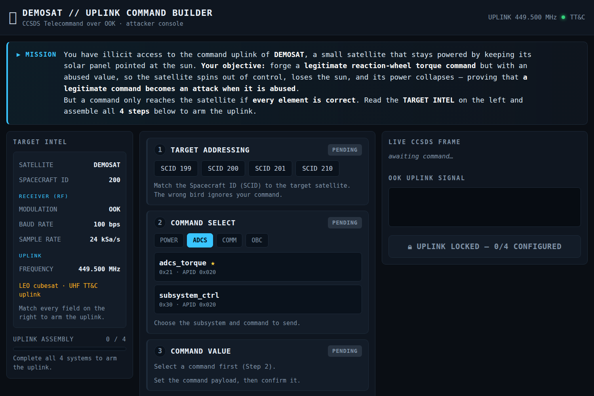

# 운영자 가이드 (한국어) — Scenario 2 "Uplink Attack"

> **DEFCON 34 Aerospace Village 부스 데모.** 부스를 **직접 운영하는 담당자**가 처음부터 끝까지
> 따라 하면 데모가 돌아가도록 만든 **실행 매뉴얼**입니다. 명령어는 그대로 복사·붙여넣기 하면 됩니다.
>
> 진행 순서: **준비물 → 최초 설치 → 물리 셋업 → 시연 → 리셋.**
> 관람객이 손에 쥐고 따라 하는 카드는 `participant-guide.md`(영어)입니다.

---

## 0. 데모 개요

한 줄 메시지: **"정상적인 명령도 값을 악용하면 공격이 된다."**

관람객이 위성의 **리액션휠 토크(자세제어) 명령**을 — 프로토콜은 완전히 정상인데 — **값만 과도하게**
실어 위성으로 쏩니다. 위성이 자세를 잃고 회전 → 태양을 추적하던 태양광 패널이 태양을 놓침 →
**발전량이 0으로 붕괴** → 지상국 대시보드가 빨갛게 **ENERGY SUPPLY CRITICAL** 경보 + 물리 태양광
패널이 무한 회전. _(실제 RF 송신은 없고 업링크는 소프트웨어로 시뮬레이션됩니다.)_

### 시연 단계

```
① 명령 조립          ② IQ 생성        ③ 위성 조준              ④ 송신                ⑤ 피해
Command Builder ─▶ attack.cf32 ─▶ gpredict+Virtual Antenna로  ─▶ Virtual Antenna가 IQ 송신 ─▶ victim 지상국
웹 화면             (IQ 신호파일)     가상 위성 조준·정렬        (uplink 발사)          대시보드 경보
(4스텝 퍼즐)                         └▶ 🛰️ 안테나 모터           └▶ ☀️ 솔라패널 모터    (웹 화면)
                                        좌↔우 조준 스윕            무한 회전
```

| 단계            | 어디서                                     | 물리 모터                         |
| --------------- | ------------------------------------------ | --------------------------------- |
| **① 명령 조립** | Command Builder 웹 (`:8000`)               | —                                 |
| **② IQ 생성**   | Command Builder `GENERATE` → `attack.cf32` | —                                 |
| **③ 위성 조준** | gpredict + OpenVSA(Virtual Antenna)        | 🛰️ **안테나 스텝모터** 좌↔우 스윕 |
| **④ 송신**      | OpenVSA `TRANSMIT`                         | ☀️ **솔라패널 서보** 무한 회전    |
| **⑤ 피해**      | victim 지상국 대시보드 (`:4540`)           | (①③④ 모터 상태 지속)              |

### 토폴로지 (노트북 1대 기준, 아두이노 2대 USB 연결)

```
[노트북 — 전부 localhost]                              [USB 시리얼]
  · Command Builder 웹     :8000  ─ ① 명령/② IQ           ┌─▶ 🛰️ 안테나 (스텝 28BYJ-48)
  · gpredict ── rotctld ──▶ OpenVSA :4533 ─ ③ 조준         │
  · OpenVSA(Virtual Antenna) ─ ④ TRANSMIT ─ forward ▶ :4536 ┐  │   bridge.js
  · 지상국(GS)  대시보드 :4540 / 업링크수신 :4536 ◀┘ ─ ⑤ ──┴─▶ ☀️ 솔라패널 (서보)
```

> 관객용 대시보드를 크게 띄우려면 victim 지상국을 **별도 PC/모니터**로 분리해도 됩니다. 이때
> `localhost`를 지상국 PC의 LAN IP(`<GS>`)로 바꾸면 됩니다. 기본 안내는 1대(localhost) 기준입니다.

---

## 1. 준비물

**소프트웨어**

- [ ] **Node.js 20 이상** — 지상국 서버 + 시리얼 브릿지 구동
- [ ] **Python 3 + numpy** — Command Builder 웹앱 구동
- [ ] **OpenVSA** (공격자 Virtual Antenna 도구) 소스 — ④ 송신
- [ ] **Docker Desktop** — gpredict(위성 추적/조준, ③)를 컨테이너로 격리 실행(호스트 설치 불필요)
- [ ] 최신 브라우저 (Chrome / Edge / Firefox) — 전체화면(F11)

**하드웨어 (물리 연출)**

- [ ] 노트북 1대 (macOS / Windows / Linux). 관객용 외부 모니터 권장
- [ ] 🛰️ **안테나 축** — 아두이노 + **스텝모터 28BYJ-48 + ULN2003 드라이버**
- [ ] ☀️ **솔라패널 축** — 아두이노 + **서보** - **무한 회전 연출**을 하려면 **연속회전 서보(FS90R)** 또는 _연속회전 개조한 SG90_ 필요
      (표준 SG90은 0–180°만 되어 무한 회전 불가 — [3장](#3-물리-셋업-배선--브릿지) 참고)
- [ ] 외부 **5V 전원**(모터용) + 점퍼선, 공통 GND, **데이터용** USB 케이블(충전전용 X)

---

## 2. 최초 설치 (1회)

### 2-1. 소프트웨어 설치

터미널(맥: 터미널.app / 윈도우: PowerShell)에서:

```bash
node --version                 # v20 이상 확인 (없으면 https://nodejs.org LTS 설치)
python3 --version              # 3.x 확인
python3 -m pip install numpy   # Command Builder에 필요
```

gpredict는 **호스트에 설치하지 않습니다** — `attacker/gpredict-web/run.sh`가 Docker 컨테이너 안에서
gpredict+noVNC를 돌립니다(호스트 오염 없음). Docker Desktop만 있으면 됩니다. numpy는 conda/전역 대신
venv 권장: `cd attacker/packet-generator/webapp && python3 -m venv .venv && . .venv/bin/activate && pip install numpy`.

프로젝트 폴더 구조:

```
scenario2-uplink-attack/
├─ victim/             지상국 (대시보드 + 백엔드)      ← Node
├─ attacker/           공격자 콘솔
│  ├─ packet-generator/  ①② Command Builder (명령 조립 웹)  ← Python
│  └─ console·openvsa·gpredict/  ③ 위성 조준 (포크·임베드)
├─ arduino/            물리 안테나·솔라패널 스케치 + 브릿지
└─ docs/               가이드 문서 (지금 이 문서)

# 위성 설정·CCSDS 코덱의 단일 원본 = attacker/openvsa/satellites/demosat/
#   (victim 지상국·Command Builder·OpenVSA 모두 여기서 로드/import)
```

### 2-2. OpenVSA 위성 플러그인 (이미 적용됨)

`attacker/openvsa`는 **demosat 플러그인 + forward 패치가 이미 적용된 포크**라 추가 드롭인이 필요 없습니다.

> **자기 OpenVSA를 따로 쓸 때만** 수동 적용: `attacker/openvsa/satellites/demosat/*`와
> `.../satellites/hardware-effects.json`을 `<OpenVSA>/satellites/`로 복사한 뒤
> `git -C <OpenVSA> apply attacker/openvsa/server-forward-payload.patch`.
> (`demosat/`에 `ccsds_ook.py`가 `decoder.py`와 함께 있어야 하고, 패치가 없으면 토크 수치는 안 보입니다.)

### 2-3. 가상 TLE 등록 (gpredict)

gpredict `Edit → Update TLE data`로 **DEMOSAT 가상 TLE**를 추가하고, 로테이터 인터페이스를 등록:
`Edit → Preferences → Interfaces → Rotators → Add` → Host `localhost`, **Port `4533`**(OpenVSA rotctld),
Az 0–360 / El 0–90.

### 2-4. 아두이노 스케치 업로드 + 단독 테스트

Arduino IDE에서 각 스케치를 열어 보드/포트 선택 후 업로드(추가 라이브러리 불필요):

```
arduino/solar_panel_uno/solar_panel_uno.ino   → 솔라패널 보드
arduino/antenna_gimbal/antenna_gimbal.ino     → 안테나 보드
```

업로드 후 **시리얼 모니터 9600 baud**로 모터를 단독 검증(브릿지 없이):

| 보드      | 입력             | 기대 동작                               |
| --------- | ---------------- | --------------------------------------- |
| ☀️ 솔라   | `SPIN` / `STOP`  | 연속회전 서보가 무한 회전 / 정지        |
| ☀️ 솔라   | `OFFSUN` / `SUN` | 0°(태양 이탈) / 90°(정상) — 표준 서보용 |
| 🛰️ 안테나 | `SWEEP`          | 좌↔우(150°↔210°) 조준 스윕 시작         |
| 🛰️ 안테나 | `TRACK`          | 스윕 정지, 위치 고정                    |

> 배선표·포트 인식 문제(macOS)·다른 스텝 드라이버 교체법은 **`arduino/README.md`**에 정리되어 있습니다.

---

## 3. 물리 셋업 (배선 + 브릿지)

### 3-1. 배선

`arduino/README.md`의 배선표를 따르세요. 요약:

- 🛰️ **안테나 (28BYJ-48 + ULN2003):** IN1→D8, IN2→D9, IN3→D10, IN4→D11, V+/GND는 외부 5V(아두이노 GND와 공통).
- ☀️ **솔라패널 (서보):** 신호선→D9, V+→외부 5V(부하용, 아두이노 5V 핀 X), GND 공통.

### 3-2. 두 모터가 언제 움직이나 (자동)

브릿지(`bridge.js`)가 지상국 상태를 폴링해 자동으로 구동합니다:

- 🛰️ **안테나 = ③ 조준** — 지상국에 “조준 성공” 신호(`acquiring`)가 들어오면 → **좌↔우 스윕**.
  공격(텀블링)이 시작되면 빔 상실 지터로 전환.
- ☀️ **솔라패널 = ④ 송신 결과** — 공격이 적용되면 → **무한 회전(SPIN)**, 정상 복귀 시 정지(STOP).

### 3-3. 브릿지 실행

포트는 본인 것으로(`ls /dev/cu.usbmodem*`). **무한 회전 서보면 `PANEL_SPIN=1`을 꼭 붙이세요:**

```bash
cd arduino/bridge
SOLAR_PORT=/dev/cu.usbmodemXXXX ANT_PORT=/dev/cu.usbmodemYYYY PANEL_SPIN=1 node bridge.js
```

- `PANEL_SPIN=1` — 솔라패널이 **연속회전 서보(FS90R/개조 SG90)**일 때. 공격 시 `SPIN`(무한 회전).
- `PANEL_SPIN` 생략 — 표준 SG90. 공격 시 각도 스윙(0°, 태양 이탈)으로 대체 연출.

> **SG90이 계속 돌 수 있나요?** 표준 SG90은 내부 스토퍼+피드백 포텐쇼미터 때문에 **무한 회전 불가**입니다.
> ① **FS90R**(같은 9g 규격의 연속회전 버전, 무납땜 드롭인) 또는 ② **SG90을 연속회전 개조**(스토퍼 탭 제거 +
> 포텐쇼미터를 고정저항으로 대체)하면 됩니다. 둘 다 펌웨어의 `SPIN`/`STOP`(중립 1500µs 정지)으로 그대로 구동됩니다.

---

## 4. 시연 (5단계, 순서대로)

### 준비: 4개 프로세스 실행

각각 별도 터미널에서 (지상국을 가장 먼저):

```bash
# 터미널 A — victim 지상국 (대시보드 :4540 / 업링크 수신 :4536)
cd victim/backend && node server.js
#   부스 연출: ATTACK_DELAY_MS=2500 node server.js  (경보까지 지연 단축)

# 터미널 B — attacker 3화면 (OpenVSA + gpredict + 콘솔). 최초 1회: attacker/setup.sh
cd attacker && ./gpredict-web/run.sh &                         # gpredict는 Docker 격리 → noVNC(:6080)
GPREDICT_WEB_URL='http://localhost:6080/vnc.html?autoconnect=1&resize=remote' ./launch.sh
#   OpenVSA(rotctld :4533 / forward :4536) + 콘솔(:8090)을 함께 띄우고 3화면 URL을 출력
#   ※ gpredict는 호스트에 설치 안 됨(컨테이너 안에만). 네이티브 설치는 선택.

# 터미널 C — 시리얼 브릿지 (물리 모터)
cd arduino/bridge && SOLAR_PORT=/dev/cu.usbmodemXXXX ANT_PORT=/dev/cu.usbmodemYYYY PANEL_SPIN=1 node bridge.js

# 터미널 D — Command Builder (관람객 조작)
cd attacker/packet-generator/webapp && UPLINK_OUT_DIR=~/uplink python3 app.py   # :8000
```

지상국 대시보드 `http://localhost:4540`을 관객 모니터에 **F11 전체화면**으로. 초록 정상 화면 확인 👇


---

### ① 명령 조립 — Command Builder 웹

`http://localhost:8000`. 관람객이 조작하는 공격자 콘솔입니다. 왼쪽 **TARGET INTEL**에 모든 정답이 있습니다 👇



4단계 퍼즐을 정답대로 조립(정답은 왼쪽 도시어):

| 단계                      | 무엇을                                             | 정답                         | 왜                                |
| ------------------------- | -------------------------------------------------- | ---------------------------- | --------------------------------- |
| **1 · TARGET ADDRESSING** | Spacecraft ID(SCID)                                | **SCID 200**                 | 잘못된 ID → 다른 위성 → 명령 무시 |
| **2 · COMMAND SELECT**    | 서브시스템·명령                                    | **ADCS → `adcs_torque`** ★   | 리액션휠 토크 명령                |
| **3 · COMMAND VALUE**     | 토크 슬라이더 → 안전(초록) 넘겨 빨강 → **CONFIRM** | **999 mNm** (안전 ≤500 초과) | 과도한 토크 → 자세 상실           |
| **4 · RF CONFIG**         | 변조·통신속도·샘플레이트                           | **OOK · 100 bps · 24 kSa/s** | 수신기와 안 맞으면 복조 불가      |

네 단계가 모두 `LOCKED ✓` → **UPLINK ASSEMBLY 4 / 4**, 빨간 **⚡ GENERATE UPLINK IQ** 버튼 활성화 👇


> 오른쪽 **LIVE CCSDS FRAME**의 `OPCODE 21`, `PAYLOAD 03 E7`(=999)이 실제 텔레커맨드가 만들어지는 과정입니다.

### ② IQ 생성

**⚡ GENERATE UPLINK IQ** → `~/uplink/attack.cf32`(IQ 신호 파일) 생성. _(아직 송신 X — 먼저 조준.)_

### ③ 위성 조준 — 3화면 콘솔(gpredict + OpenVSA) → 🛰️ 안테나 스윕

터미널 B가 출력한 **3화면 URL**을 엽니다 (`http://localhost:8090/?gs=…&gp=…`). 한 웹 화면에
**gpredict(위성 추적)** 와 **OpenVSA(Virtual Antenna)** 가 나란히 임베드됩니다.

1. 콘솔의 gpredict 창 → `Antenna Control` → Target **DEMOSAT** → Rotator **OpenVSA** → **Engage**.
   gpredict가 az/el을 rotctld(`4533`)로 흘려 **OpenVSA 안테나가 위성을 향해 슬루**합니다.
2. 위성이 지평선 위(el > 0°)이고 정렬되면 콘솔 상단 **◎ ACQUIRE LOCK** 버튼을 누릅니다 →
   지상국에 조준 성공(`/api/acquire`)이 전달되고 **🛰️ 물리 안테나가 좌↔우로 조준 스윕**합니다.

> 버튼 대신 CLI로도 가능: `curl -X POST http://localhost:4540/api/acquire` (해제는 `-d '{"on":false}'`).
> OpenVSA의 lock 이벤트에 연결해 자동화할 수도 있습니다(동일 엔드포인트).

### ④ 송신 — OpenVSA TRANSMIT → ☀️ 솔라패널 무한 회전

OpenVSA UI에서 **`attack.cf32` 로드 → TRANSMIT**. OpenVSA가 업링크를 검증(안테나 정렬·449.5 MHz·링크 마진)한 뒤
디코드된 명령을 지상국 `:4536`으로 forward → `ATTACK_DELAY_MS` 뒤 공격 적용 → ☀️ **솔라패널이 무한 회전**을 시작합니다.

### ⑤ 피해 — victim 지상국 대시보드

전체화면 빨간 경보가 ~5초 번쩍인 뒤, 라이브 텔레메트리가 붕괴를 계속 보여줍니다 👇


> **성공 판정:** 배너 빨강 **ENERGY SUPPLY CRITICAL**, Solar Panel **SUN-TRACK LOST**, Torque **999 mNm**,
> ADCS **TUMBLING**, Power Gen **0 W 부근 유지**, Battery 방전, Comm **LOST**, UPLINK ACTIVITY에
> `ACCEPTED · adcs_torque [0x03 0xe7]`. 물리적으로 🛰️ 안테나·☀️ 솔라패널 모터가 함께 움직이면 완성입니다. ✅

---

## 5. 리셋 (다음 관람객 준비)

```bash
curl -X POST http://localhost:4540/api/reset      # 지상국 정상 복귀 + 조준(acquiring) 해제
```

지상국 대시보드가 즉시 초록 정상으로 복귀하고, 🛰️ 안테나 스윕/☀️ 솔라 회전이 멈춥니다(브릿지가 정상 상태를
반영). gpredict 추적은 그대로 두거나 다음 관람객을 위해 유지하면 됩니다. Command Builder는 상태가 없어
리셋 불필요(원하면 새로고침).

> 팁: 리셋 명령을 바탕화면 스크립트(`reset.sh`/`reset.bat`)로 만들어 두면 한 번에 누르기 편합니다.

---

## 6. 연출 튜닝 노브

| 목적                    | 위치                                                                               | 값                                    |
| ----------------------- | ---------------------------------------------------------------------------------- | ------------------------------------- |
| 업링크 후 경보까지 지연 | 지상국 env `ATTACK_DELAY_MS`                                                       | 기본 4000 ms, 부스 **1500–3000** 권장 |
| 안전 토크 임계값        | `attacker/openvsa/satellites/demosat/c2protocol.json` opcode `0x21` → `safeAbsMax` | 기본 500                              |
| 방전·태양추적 이탈 속도 | `victim/backend/satellite-state.js` → `adcs_torque_magnitude`                      | 토크 크기 비례                        |
| 안테나 스윕 범위        | `arduino/antenna_gimbal.ino` → `SWEEP_LO_AZ` / `SWEEP_HI_AZ`                       | 기본 150 / 210                        |
| 솔라 회전 속도          | 안테나 보드 `SPIN <us>`(1000–2000, 1500=정지) 또는 브릿지 기본 2000                | 연속회전 서보                         |
| 지상국 포트             | 지상국 env `GS_HTTP_PORT` / `UPLINK_PORT`                                          | 기본 4540 / 4536                      |

---

## 7. 트러블슈팅

| 증상                                         | 확인 / 해결                                                                                                             |
| -------------------------------------------- | ----------------------------------------------------------------------------------------------------------------------- |
| 대시보드가 “CONNECTING…”에서 멈춤            | 지상국(:4540) 실행 여부, 방화벽, 브라우저 주소                                                                          |
| `node: command not found`                    | Node 20 미설치 → nodejs.org LTS 설치 후 터미널 재시작                                                                   |
| Command Builder `ModuleNotFoundError: numpy` | `python3 -m pip install numpy`                                                                                          |
| GENERATE 버튼 계속 잠김                      | 4단계 모두 `LOCKED ✓`인지(특히 3단계 CONFIRM, 4단계 RF 3개 선택)                                                        |
| gpredict가 안테나를 못 움직임                | Rotators 설정 Host/Port=OpenVSA `rotctld :4533`인지, Engage/Track 눌렀는지, 위성 el>0인지                               |
| ③에서 🛰️ 물리 안테나가 안 움직임             | `curl -X POST :4540/api/acquire` 실행했는지, 브릿지 실행·`ANT_PORT` 맞는지, 시리얼 모니터로 `SWEEP` 단독 확인           |
| ④에서 ☀️ 솔라패널이 회전 안 함               | 연속회전 서보인지(표준 SG90 불가), 브릿지에 **`PANEL_SPIN=1`** 붙였는지, `SOLAR_PORT` 맞는지, 시리얼로 `SPIN` 단독 확인 |
| TRANSMIT 눌러도 경보 없음                    | 명령이 `adcs_torque`·값 999인지, `UPLINK_DEST`가 지상국 `:4536`인지, `ATTACK_DELAY_MS`만큼 기다렸는지                   |
| OpenVSA cf32 디코드 실패                     | `satellites/demosat/`에 `ccsds_ook.py`가 `decoder.py`와 함께 있는지                                                     |
| 포트 인식 안 됨(macOS)                       | 데이터용 케이블인지, USB 허브 말고 직결인지, `cu.` 디바이스 사용                                                        |
| 초기화                                       | `curl -X POST :4540/api/reset`                                                                                          |

> **부분 점검(개발용, 시연 경로 아님):** 하드웨어/OpenVSA 없이 지상국 반응만 확인하려면
> `curl -X POST :4540/api/inject -H 'Content-Type: application/json' -d '{"command":"adcs_torque","payload":["0x03","0xe7"]}'`.
> 이는 컴포넌트 단독 점검용이며, 실제 시연은 위 ①~⑤ 물리 경로로만 진행합니다.

---

## 8. 자주 묻는 질문

**Q. 노트북 1대로 되나요?** 네. 지상국·OpenVSA·gpredict·Builder를 모두 localhost로 띄우고 아두이노 2대를 USB로 연결합니다. 관객 대시보드만 외부 모니터로 빼면 됩니다.

**Q. 두 브라우저 탭이 헷갈려요.** `:8000` = 공격자(Command Builder, 관람객 조작), `:4540` = 피해자(지상국 대시보드, 관객에게 노출).

**Q. 관람객이 값을 999가 아닌 다른 값으로?** 안전 임계값(500) 초과면 공격 성립, 이하면 위성이 견디고 경보가 안 뜹니다 — 이 대비가 좋은 교육 포인트입니다.

---

### 문서 유지보수 메모

- 이 한국어 문서가 **부스 운영 기준(source of truth)**입니다. 영어 `operator-guide.md`는 요약본이며 절차·포트·환경변수 변경 시 함께 갱신하세요.
- 스크린샷 원본: `docs/screenshots/`.
