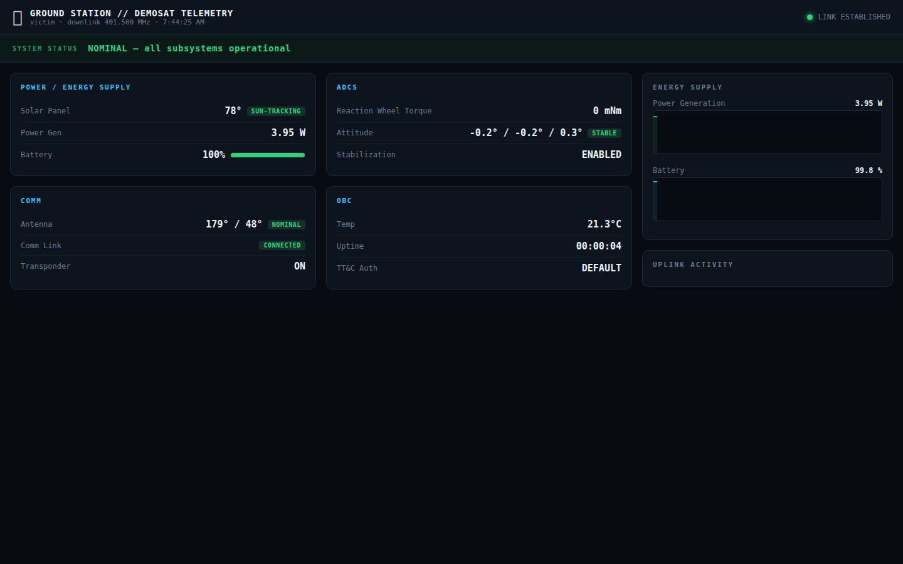
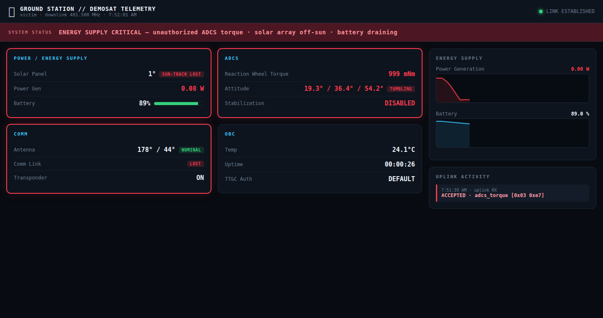

# Operator Guide — Phases ①②③ "Uplink Attack" (shared base)

DEFCON 34 Aerospace Village. For **booth operators** running the demo. For the
card visitors follow, see `participant-guide.md`.

> 📦 **This guide lives in `common/docs/` and covers the shared phases ①②③** used by
> scenario 2 (Uplink Attack) and scenario 3 (Telemetry Spoofing). **Run from a scenario
> folder**, not from `common/`: `cd ../scenario2-uplink-attack && ./start-victim.sh` and
> `./start-attacker.sh up`. The manual `cd victim/backend` / `cd attacker/…` paths below
> are now under `common/` (e.g. `common/victim/backend`); prefer the start scripts. For
> scenario 3's phase ④ (drone spoof) see `../scenario3-spoofing/README.md`.

> 🇰🇷 **부스 담당자용 상세 실행 매뉴얼(스크린샷 포함)은 `operator-guide-kr.md`** 를 보세요 —
> 설치부터 간편 모드(노트북 1대) 시연, 관람객 응대 스크립트까지 단계별로 정리되어 있습니다.
> 이 영어 문서는 간결한 운영 레퍼런스입니다.

Message of the demo: **"Even a legitimate command becomes an attack when it is abused."**
A visitor forges a reaction-wheel torque command and uplinks it; the victim ground
station dashboard escalates to **ENERGY SUPPLY CRITICAL** and the physical solar
panel spins out of control. No real RF — the uplink is software-simulated.

## 1. Topology

```
[Attacker laptop]                                     [Victim Windows PC]
  · Command Builder web UI  http://localhost:8000        · GS dashboard  http://GS:4540
  · gpredict (virtual TLE → az/el) ─rotctld─┐            · GS backend  :4536 (uplink in)
  · OpenVSA (Virtual Antenna)  rotctld :4533 / rigctld :4532 ◀┘             │
      forward (decoded cmd) → ws://GS:4536 ────────────────────┘
      └─(pointing az/el)─▶ serial bridge → Arduino antenna stepper + solar-panel servo
```

Full sequence: **① build IQ → ② point the antenna at the virtual satellite with
gpredict (the antenna motor physically slews) → ③ confirm alignment → ④ Virtual Antenna transmits
the IQ → ⑤ solar panel spins, GS alarms.** Software-simulated: gpredict drives the
rotator over rotctld; OpenVSA validates the uplink (antenna alignment, frequency, link
margin) and forwards the decoded command to the GS. `GS` = the victim PC's LAN IP.

> Physical motors (via `arduino/bridge/bridge.js` polling `/api/state`): during
> **pointing**, `POST /api/acquire` sets the `acquiring` flag → the antenna stepper
> sweeps left↔right (`SWEEP`). On **transmit/attack**, the solar panel spins endlessly
> (`SPIN`, with `PANEL_SPIN=1` + a continuous-rotation servo). See the Korean runbook
> `operator-guide-kr.md` for the full 5-step physical flow.

## 2. Prerequisites
- Both machines on the same LAN. Note the victim PC's IP (referred to as `GS`).
- Attacker laptop: Python 3 + numpy, Node 20, **gpredict** (for the antenna-pointing step).
- Victim PC: Node 20. Modern browser in full-screen (F11).
- (Optional) Arduino reachable over HTTP for the physical panel trigger.

## 3. Startup order

**① Victim ground station (start first)**
```
cd victim/backend
node server.js
#   dashboard  http://localhost:4540    ·    uplink input  :4536
#   optional:  ATTACK_DELAY_MS=2500  ARDUINO_URL=http://<arduino>/trigger
```
Open `http://localhost:4540` full-screen on the audience-facing monitor.

**② OpenVSA (attacker Virtual Antenna)** — use the forked, pre-integrated copy in `attacker/openvsa`
(demosat plugin + forward patch already applied):
```
cd attacker/openvsa
UPLINK_DEST=ws://<GS>:4536 node server.js      # forward target = victim GS
npm start                                        # Electron Virtual Antenna UI (separate process)
```
`attacker/openvsa/satellites/demosat/` is the single source of truth for the satellite
config + CCSDS codec (the victim GS and Command Builder load/import from here too).
Using your OWN OpenVSA instead? Copy `attacker/openvsa/satellites/demosat/*` and
`.../satellites/hardware-effects.json` into it and `git apply attacker/openvsa/server-forward-payload.patch`.

**③ Command Builder console (attacker)**
```
cd attacker/packet-generator/webapp
UPLINK_OUT_DIR=~/uplink python3 app.py
#   http://localhost:8000  — the visitor operates this
#   GENERATE writes ~/uplink/attack.cf32 (loaded into OpenVSA)
```
The visitor must assemble a valid uplink as a 4-step puzzle before GENERATE unlocks:
**1** Spacecraft ID (SCID) · **2** command · **3** command value · **4** RF config
(modulation/baud/sample rate). The answers are on the **TARGET INTEL** dossier
(left panel); the intended attack is `adcs_torque` at 999 mNm. If a visitor is stuck,
point them at the dossier — every field must match.

**④ Point at the virtual satellite (gpredict) → transmit**
1. In gpredict, load the **DEMOSAT virtual TLE** and add a Rotator interface at
   `localhost:4533` (OpenVSA rotctld).
2. Open **Antenna Control**, target DEMOSAT, **Engage/Track** — gpredict streams az/el
   to rotctld and the antenna slews to acquire the bird (physical stepper too, once the
   rotctld→serial tap is wired). Wait until the satellite is above the horizon and aligned.
3. In OpenVSA, **load `attack.cf32` → TRANSMIT**. The uplink passes validation, forwards
   to the GS, and the solar panel spins as the dashboard escalates to ENERGY SUPPLY CRITICAL.

During pointing, once gpredict reports lock, fire the antenna acquisition sweep:
`curl -X POST http://localhost:4540/api/acquire` (clear with `-d '{"on":false}'`; also
cleared on reset). This can be wired to OpenVSA's lock event.

> Component self-test only (NOT a demo path): with no hardware/OpenVSA you can check the
> GS reaction alone via `curl -X POST http://localhost:4540/api/inject -H 'Content-Type: application/json' -d '{"command":"adcs_torque","payload":["0x03","0xe7"]}'`

## 4. Reset between visitors
```
curl -X POST http://localhost:4540/api/reset      # return the GS to nominal
```
The Command Builder is stateless — no reset needed (a refresh is optional).

## 5. Tuning knobs
| Goal | Location | Value |
|---|---|---|
| Telemetry reaction delay | GS env `ATTACK_DELAY_MS` | default 4000 ms (booth: 1500–3000) |
| Safe torque threshold | `attacker/openvsa/satellites/demosat/c2protocol.json` opcode `0x21` → `safeAbsMax` | 500 |
| Battery drain / sun-track loss speed | `victim/backend/satellite-state.js` → `adcs_torque_magnitude` (drainRate / swingSpeed) | scales with torque magnitude |
| Antenna acquisition sweep | `POST /api/acquire` → bridge sends `SWEEP`; arc in `antenna_gimbal.ino` `SWEEP_LO_AZ`/`SWEEP_HI_AZ` | default 150°/210° |
| Solar panel spin | bridge `PANEL_SPIN=1` (continuous-rotation servo) → `SPIN` on attack; speed via `SPIN <us>` | 1000–2000µs (1500=stop) |
| Arduino HTTP trigger | GS env `ARDUINO_URL` (POST on attack onset) | logs only if unset |

## 6. What "correct" looks like

**Nominal** — green banner, SUN-TRACKING / STABLE / CONNECTED, battery 100%:



**Attack lands** (~ATTACK_DELAY_MS later) — a full-screen alarm flashes for ~5 s:


**Sustained critical** — after the flash clears, live telemetry keeps showing the
collapse: red **ENERGY SUPPLY CRITICAL** banner, **SUN-TRACK LOST**, Power Gen graph
plunging toward 0 W (stays low), battery draining, ADCS **TUMBLING**, Comm **LOST**,
and `ACCEPTED · adcs_torque [0x03 0xe7]` in UPLINK ACTIVITY:



**Command Builder** — the visitor's attacker console; GENERATE unlocks only at 4/4:


## 7. Troubleshooting
| Symptom | Check |
|---|---|
| Dashboard stuck on "CONNECTING…" | GS backend (:4540) not running, or firewall |
| Uplink never reaches GS | OpenVSA `UPLINK_DEST` points at the right `GS` IP; :4536 open; uplink passed OpenVSA validation (antenna aligned, freq 449.5 MHz) |
| cf32 fails to decode in OpenVSA | `ccsds_ook.py` copied alongside `decoder.py` in `satellites/demosat/` |
| No alarm | Command must be `adcs_torque` with torque above the safe threshold |

## 8. Open items
- **Arduino motors**: firmware + bridge **done and wired** — antenna `SWEEP` on
  `/api/acquire` (pointing) and solar-panel `SPIN` on attack (`PANEL_SPIN=1`, needs a
  continuous-rotation servo — FS90R or a continuous-modified SG90; a stock SG90 cannot
  spin). Self-testable over the serial monitor. **Remaining: physical wiring bring-up +
  booth motor tuning on real hardware.** See `arduino/README.md`.
- **OpenVSA acquire hook (optional)**: `/api/acquire` can be fired by the operator after
  gpredict lock, or wired to OpenVSA's lock event to automate the antenna sweep.
- **OpenVSA end-to-end**: headless path verified (cf32 decode → :4536 forward → GS
  applies the effect). Full **gpredict + Electron UI + real uplink** rehearsal still to
  be run live.
