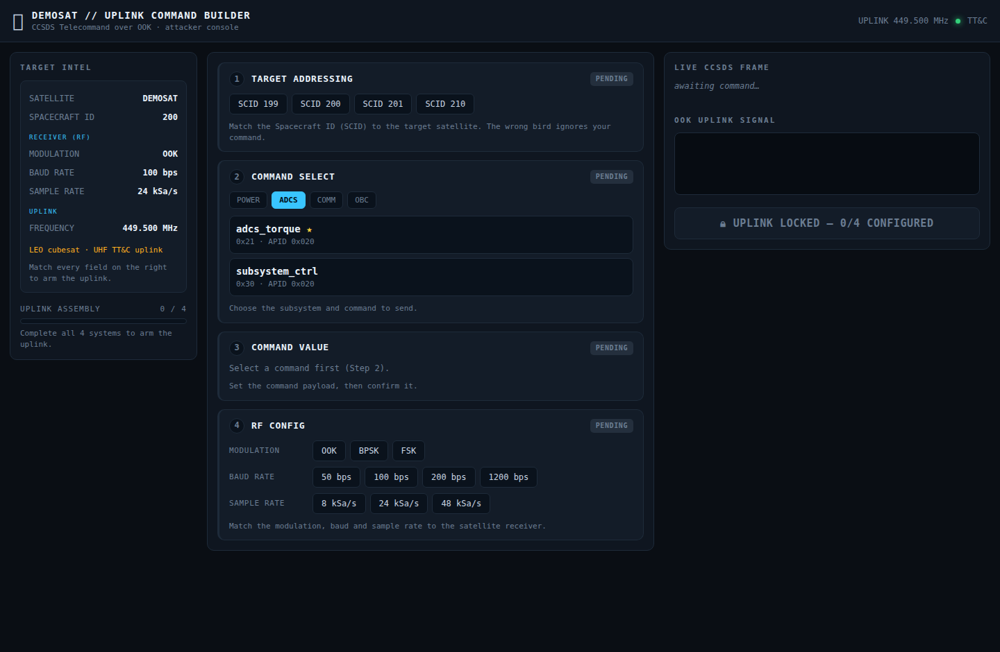
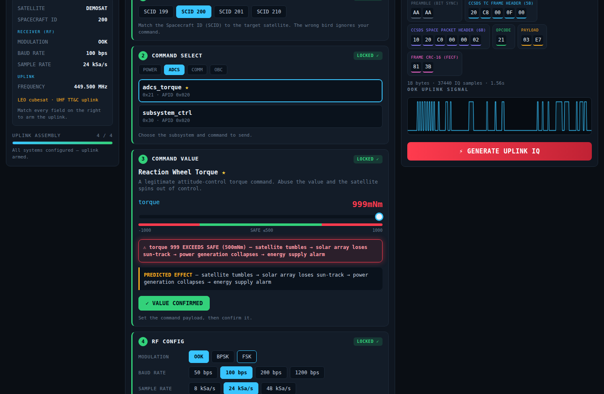
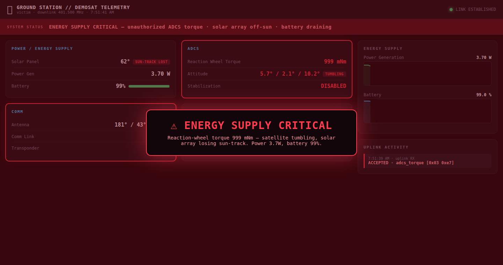

# 운영자 가이드 (한국어) — Scenario 2 "Uplink Attack"

> **DEFCON 34 Aerospace Village 부스 데모.** 이 문서는 부스를 **직접 운영하는 담당자**가
> 처음부터 끝까지 따라 하면 데모가 돌아가도록 만든 **실행 매뉴얼**입니다.
> 명령어를 그대로 복사·붙여넣기만 하면 됩니다.
>
> 관람객이 손에 쥐고 따라 하는 카드는 `participant-guide.md`(영어)입니다.

---

## 0. 이 데모가 보여주는 것 (30초 요약)

한 줄 메시지: **"정상적인 명령도 값을 악용하면 공격이 된다."**

관람객이 위성의 **리액션휠 토크(자세제어) 명령**을 — 프로토콜은 완전히 정상인데 — **값만 과도하게**
실어서 위성으로 쏩니다. 그러면 위성이 자세를 잃고 빙글빙글 돌기 시작하고 → 태양을 추적하던
태양광 패널이 태양을 놓치고 → **발전량이 0으로 붕괴** → 지상국 대시보드가 빨갛게
**ENERGY SUPPLY CRITICAL** 경보를 띄우고 (연결 시) 실제 태양광 패널 모형이 폭주 회전합니다.

> 실제 무선(RF) 송신은 없습니다. 업링크는 전부 **소프트웨어로 시뮬레이션**됩니다. HackRF·안테나
> 없이도 노트북 한 대로 완전히 동작합니다.

**데모 흐름 한눈에:**

```
[관람객이 명령 조립]        [공격 송신]           [피해 위성/지상국]
 Command Builder 웹  ──▶  attack.cf32  ──▶  OpenVSA 업링크  ──▶  지상국 대시보드 경보
 (4스텝 퍼즐)             (IQ 신호파일)      (또는 inject 폴백)     + 태양광 패널 폭주(선택)
```

---

## 목차

1. [준비물 체크리스트](#1-준비물-체크리스트)
2. [설치 (최초 1회)](#2-설치-최초-1회)
3. [⭐ 간편 모드 — 노트북 1대로 5분 만에 시연](#3--간편-모드--노트북-1대로-5분-만에-시연)
4. [관람객 응대 스크립트](#4-관람객-응대-스크립트)
5. [관람객 사이 리셋](#5-관람객-사이-리셋)
6. [정식 모드 — OpenVSA 실제 업링크 연동](#6-정식-모드--openvsa-실제-업링크-연동)
7. [(선택) 아두이노 물리 패널 연결](#7-선택-아두이노-물리-패널-연결)
8. [연출 튜닝 노브](#8-연출-튜닝-노브)
9. [트러블슈팅](#9-트러블슈팅)
10. [자주 묻는 질문](#10-자주-묻는-질문)

---

## 1. 준비물 체크리스트

**최소 구성 (권장 — 간편 모드):**

- [ ] 노트북 1대 (macOS / Windows / Linux 모두 가능)
- [ ] **Node.js 20 이상** — 지상국 서버 구동용
- [ ] **Python 3 + numpy** — Command Builder 웹앱 구동용
- [ ] 최신 브라우저 (Chrome / Edge / Firefox) — 전체화면(F11) 시연
- [ ] 관객용 외부 모니터 1대 (있으면 대시보드를 크게 띄우기 좋음)

**정식 구성 (2대 + 물리 연출 — 선택):**

- [ ] 위 최소 구성 + 위성 역할 PC 1대 (지상국) / 공격자 PC 1대 (Builder + OpenVSA)
- [ ] 두 PC가 **같은 Wi-Fi/LAN**에 연결
- [ ] OpenVSA (공격자 VSA 도구) 소스
- [ ] 아두이노 + 서보/스텝모터 (물리 태양광 패널 연출) — [7장](#7-선택-아두이노-물리-패널-연결) 참고

> **처음이라면 → [3장 간편 모드](#3--간편-모드--노트북-1대로-5분-만에-시연)부터 하세요.** OpenVSA·아두이노 없이
> 노트북 한 대로 “명령 조립 → 경보” 전체 스토리를 완성할 수 있고, 부스 폴백 경로로도 그대로 씁니다.

---

## 2. 설치 (최초 1회)

터미널(맥: 터미널.app, 윈도우: PowerShell)을 열고 아래를 확인/설치합니다.

**Node.js 버전 확인** (20 이상이어야 함):

```bash
node --version      # v20.x.x 이상이면 OK
```

안 깔려 있으면 https://nodejs.org 에서 LTS 버전 설치.

**Python + numpy 설치:**

```bash
python3 --version              # 3.x 확인
python3 -m pip install numpy   # Command Builder에 필요
```

**프로젝트 폴더로 이동** (경로는 본인 환경에 맞게):

```bash
cd scenario2-uplink-attack
```

이 폴더 안 구조:

```
scenario2-uplink-attack/
├─ ground-station/     ② 피해 지상국 (대시보드 + 백엔드)   ← Node
├─ packet-generator/   ① Command Builder (명령 조립 웹앱)  ← Python
├─ openvsa-plugin/     OpenVSA용 위성 플러그인 (정식 모드)
├─ arduino/            물리 태양광 패널/안테나 (선택)
└─ docs/               가이드 문서 (지금 이 문서)
```

---

## 3. ⭐ 간편 모드 — 노트북 1대로 5분 만에 시연

OpenVSA 없이, **터미널 2개**만으로 전체 스토리를 시연합니다. 부스에서 가장 안정적인 경로입니다.

### 3-1. 터미널 A — 피해 지상국 실행

```bash
cd ground-station/backend
node server.js
```

아래처럼 뜨면 성공:

```
[uplink] WS listening on :4536 (point OpenVSA UPLINK_DEST here)
[gs]     dashboard http://localhost:4540
```

브라우저에서 **http://localhost:4540** 을 열고 **F11로 전체화면**. 아래처럼 초록색 정상 화면이
보이면 됩니다 👇


> 화면 읽는 법: 상단 초록 배너 **NOMINAL**, Solar Panel **SUN-TRACKING**, Power Gen 정상,
> Battery 100%, Comm **CONNECTED**. 이게 “평화로운 위성”의 모습입니다.

### 3-2. 터미널 B — Command Builder(명령 조립 웹앱) 실행

새 터미널을 열고:

```bash
cd packet-generator/webapp
UPLINK_OUT_DIR=~/uplink python3 app.py
```

아래처럼 뜨면 성공:

```
serving on http://localhost:8000
  output dir: ~/uplink  (generated attack.cf32 lands here)
```

브라우저 새 탭에서 **http://localhost:8000** 을 엽니다. 이게 관람객이 조작하는 “공격자 콘솔”입니다 👇



> 화면 읽는 법: **왼쪽 TARGET INTEL(정보 도시어)** 에 모든 정답이 적혀 있습니다. 가운데가
> 채워야 할 **4단계 퍼즐**, 오른쪽은 조립되는 실제 **CCSDS 패킷**과 신호 파형입니다. 지금은
> `UPLINK LOCKED — 0/4 CONFIGURED` 상태(잠김)입니다.

### 3-3. 4단계 퍼즐 풀기 (관람객이 직접, 정답은 왼쪽 도시어에)

| 단계                      | 무엇을                                                     | 정답                         | 왜                                  |
| ------------------------- | ---------------------------------------------------------- | ---------------------------- | ----------------------------------- |
| **1 · TARGET ADDRESSING** | Spacecraft ID(SCID) 선택                                   | **SCID 200**                 | 잘못된 ID → 다른 위성 → 명령 무시됨 |
| **2 · COMMAND SELECT**    | 서브시스템·명령 선택                                       | **ADCS → `adcs_torque`** (★) | 위성의 리액션휠 토크 명령           |
| **3 · COMMAND VALUE**     | 토크 슬라이더를 안전구간(초록) 넘겨 빨강까지 → **CONFIRM** | **999 mNm** (안전 ≤500 초과) | 과도한 토크 → 자세 상실의 원인      |
| **4 · RF CONFIG**         | 변조·통신속도·샘플레이트 맞추기                            | **OOK · 100 bps · 24 kSa/s** | 수신기와 안 맞으면 위성이 복조 못함 |

네 단계가 모두 `LOCKED ✓` 로 잠기면 오른쪽 **UPLINK ASSEMBLY 4 / 4**, 빨간 **⚡ GENERATE UPLINK IQ**
버튼이 활성화됩니다 👇



> 오른쪽 **LIVE CCSDS FRAME** 이 바이트 단위로 조립되는 걸 보여주세요. `OPCODE 21`(adcs_torque),
> `PAYLOAD 03 E7`(= 999)이 실제 텔레커맨드 패킷이 만들어지는 과정입니다. 3단계에서 빨간 경고
> “torque 999 EXCEEDS SAFE — satellite tumbles → power collapses” 문구가 스토리를 미리 예고합니다.

### 3-4. GENERATE → 공격 파일 생성

**⚡ GENERATE UPLINK IQ** 를 누르면 `~/uplink/attack.cf32`(IQ 신호 파일)가 생성됩니다. 간편 모드에서는
이 파일을 OpenVSA에 넣는 대신, 아래 한 줄로 **업링크가 위성에 도달한 상황을 그대로 재현**합니다.

### 3-5. 터미널 C — 업링크 발사 (inject 폴백)

새 터미널에서:

```bash
curl -X POST http://localhost:4540/api/inject \
  -H 'Content-Type: application/json' \
  -d '{"command":"adcs_torque","payload":["0x03","0xe7"]}'
```

> `0x03 0xe7` = 999. Command Builder가 만든 값과 동일합니다.

### 3-6. 지상국 화면을 보세요 🚨

몇 초(`ATTACK_DELAY_MS`, 기본 4초) 뒤, 지상국이 폭발합니다:

**① 경보 플래시** — 전체화면 빨간 경고가 ~5초 번쩍입니다 👇



**② 지속 위기 상태** — 팝업이 사라진 뒤에도 라이브 텔레메트리가 붕괴를 계속 보여줍니다 👇


> **“정상 동작” 판정 기준:** 상단 배너 빨강 **ENERGY SUPPLY CRITICAL**, Solar Panel **SUN-TRACK LOST**,
> Reaction Wheel Torque **999 mNm**, ADCS **TUMBLING**, Stabilization **DISABLED**, Power Gen 그래프가
> **0 W 부근으로 곤두박질쳐 유지**, Battery 서서히 방전, Comm Link **LOST**, 우하단 UPLINK ACTIVITY에
> `ACCEPTED · adcs_torque [0x03 0xe7]` 로그. 여기까지 나오면 시연 성공입니다. ✅

---

## 4. 관람객 응대 스크립트

부스에서 관람객에게 이렇게 안내하면 자연스럽습니다.

1. **“이 위성은 태양광으로만 살아요.”** — 지상국 정상 화면(초록)을 보여주며 태양 추적 중임을 설명.
2. **“당신은 이 위성의 명령 업링크 권한을 손에 넣었습니다.”** — Command Builder를 관람객에게 넘김.
3. **“왼쪽 정보(TARGET INTEL)를 보고 4단계를 맞춰 보세요.”** — 막히면 도시어의 해당 값을 손가락으로 가리켜 줌.
   - 특히 **3단계**: “토크 슬라이더를 안전(초록) 넘어 빨강 끝(999)까지 올리고 CONFIRM.”
4. **“모든 칸이 정상 명령입니다. 규칙을 어긴 게 없어요. 값만 과했을 뿐.”** — 핵심 메시지 전달.
5. **GENERATE 누르게 하고** → (간편 모드면 운영자가 inject 실행 / 정식 모드면 관람객이 OpenVSA에서 송신).
6. **지상국 화면을 같이 보며** 경보가 뜨는 순간을 함께 감상. “정당한 명령 하나가 위성을 죽였습니다.”

> 팁: 관람객이 **일부러 틀린 SCID나 틀린 RF**를 골라 보게 하면 “왜 아무 일도 안 일어나는지”를 통해
> ‘모든 요소가 맞아야 명령이 도달한다’는 점을 체험시킬 수 있습니다.

---

## 5. 관람객 사이 리셋

다음 관람객을 받기 전에 지상국을 정상으로 되돌립니다:

```bash
curl -X POST http://localhost:4540/api/reset
```

지상국 대시보드가 즉시 초록 정상 상태로 복귀합니다. **Command Builder는 상태가 없으므로 리셋 불필요**
(원하면 브라우저 새로고침).

> 운영 팁: 이 리셋 명령을 바탕화면 스크립트(`reset.sh` / `reset.bat`)로 만들어 두면 한 번에 누르기 편합니다.

---

## 6. 정식 모드 — OpenVSA 실제 업링크 연동

간편 모드의 `inject` 대신, 관람객이 만든 `attack.cf32`를 **실제로 OpenVSA에 로드해 업링크**하는 경로입니다.
2대(공격자 PC + 지상국 PC) 구성에 적합합니다.

### 토폴로지

```
[공격자 랩탑]                                     [Victim 지상국 PC]
  · Command Builder 웹  http://localhost:8000        · GS 대시보드  http://<GS>:4540
  · OpenVSA (VSA)                                     · GS 백엔드    :4536 (업링크 수신)
      rotctld :4533 / rigctld :4532 / ws :4534             │
      forward → ws://<GS>:4536 ────────────────────────────┘
                                                            └→ 시리얼 브릿지 → Arduino 패널/안테나 (선택)
```

`<GS>` = 지상국 PC의 LAN IP (예: `192.168.0.42`). 맥은 `ipconfig getifaddr en0`, 윈도우는 `ipconfig`로 확인.

### 6-1. 지상국 실행 (지상국 PC)

간편 모드 [3-1](#3-1-터미널-a--피해-지상국-실행)과 동일하게 `node server.js`.

### 6-2. OpenVSA에 위성 플러그인 드롭인 (공격자 PC, 최초 1회)

```bash
cp -r openvsa-plugin/demosat/*             <OpenVSA>/satellites/demosat/
cp    openvsa-plugin/hardware-effects.json <OpenVSA>/satellites/hardware-effects.json
git -C <OpenVSA> apply openvsa-plugin/server-forward-payload.patch   # 토크 값까지 지상국에 전달
```

> **주의:** `satellites/demosat/` 폴더에 `ccsds_ook.py`가 `decoder.py`와 **함께** 있어야 합니다
> (디코더가 이 파일을 import). forward 패치는 2줄짜리 선택 사항 — 없으면 지상국이 명령 이름만 보이고
> 토크 수치(999)는 안 보입니다.

### 6-3. OpenVSA 실행 (공격자 PC)

```bash
cd <OpenVSA>
UPLINK_DEST=ws://<GS>:4536 node server.js      # forward 대상 = 지상국 IP
npm start                                        # Electron VSA UI (별도 프로세스/터미널)
```

### 6-4. 관람객 송신

Command Builder에서 GENERATE → `~/uplink/attack.cf32` 생성 → **OpenVSA UI에서 이 파일 로드 →
안테나를 위성에 정렬 → TRANSMIT**. OpenVSA가 업링크를 검증(안테나 정렬·주파수 449.5 MHz·링크 마진)한
뒤 디코드된 명령을 지상국(:4536)으로 forward → 지상국 경보 발생.

> **정식 모드 라이브 리허설은 부스 전 반드시 1회 실행**하세요. 헤드리스 경로(디코드→forward→지상국)는
> 검증됐지만, Electron UI + 실제 업링크 전 구간 리허설은 현장에서 처음 돌리면 안 됩니다.

---

## 7. (선택) 아두이노 물리 패널 연결

실제 태양광 패널 모형(서보)과 안테나(스텝모터)가 지상국 상태에 맞춰 물리적으로 움직입니다.
**펌웨어·브릿지 코드는 완성**되어 있고, **실물 배선·모터 튜닝만 현장에서 하면 됩니다.**

```
지상국 :4540 /api/state ──폴링──▶ bridge.js ──시리얼──▶ ① 솔라패널 (서보 SG90)
                                            └─시리얼──▶ ② 안테나   (스텝 28BYJ-48)
```

브릿지 실행 (포트는 본인 것으로):

```bash
cd arduino/bridge
SOLAR_PORT=/dev/cu.usbmodemXXXX ANT_PORT=/dev/cu.usbmodemYYYY node bridge.js
```

- 아두이노 스케치 업로드, 배선표, 시리얼 단독 테스트(예: `OFFSUN`/`SUN`), macOS 포트 인식 문제 해결까지
  **전부 `arduino/README.md`에 정리**되어 있습니다. 물리 연출이 필요하면 그 문서를 따르세요.
- 아두이노 없이도 데모는 완결됩니다(대시보드만으로 충분). 물리 패널은 “보여주기” 강화용입니다.

---

## 8. 연출 튜닝 노브

| 목적                           | 위치                                                                                           | 값                                                                                 |
| ------------------------------ | ---------------------------------------------------------------------------------------------- | ---------------------------------------------------------------------------------- |
| 업링크 후 경보까지 지연        | 지상국 env `ATTACK_DELAY_MS`                                                                   | 기본 4000 ms. 부스는 **1500–3000** 권장. 예: `ATTACK_DELAY_MS=2500 node server.js` |
| 안전 토크 임계값               | `openvsa-plugin/demosat/c2protocol.json` opcode `0x21` → `safeAbsMax`                          | 기본 500                                                                           |
| 배터리 방전·태양추적 이탈 속도 | `ground-station/backend/satellite-state.js` → `adcs_torque_magnitude` (drainRate / swingSpeed) | 토크 크기에 비례                                                                   |
| 아두이노 HTTP 트리거(선택)     | 지상국 env `ARDUINO_URL` (공격 순간 POST)                                                      | 미설정 시 로그만                                                                   |
| 지상국 포트 변경               | 지상국 env `GS_HTTP_PORT` / `UPLINK_PORT`                                                      | 기본 4540 / 4536                                                                   |

예) 지연을 짧게 + 아두이노 트리거까지:

```bash
ATTACK_DELAY_MS=2000 ARDUINO_URL=http://<arduino-ip>/trigger node server.js
```

---

## 9. 트러블슈팅

| 증상                                                 | 확인 / 해결                                                                                                                      |
| ---------------------------------------------------- | -------------------------------------------------------------------------------------------------------------------------------- |
| 대시보드가 “CONNECTING…”에서 멈춤                    | 지상국 백엔드(:4540) 실행 여부, 방화벽, 브라우저가 맞는 주소인지                                                                 |
| `node: command not found`                            | Node.js 20 미설치 → https://nodejs.org 에서 LTS 설치 후 터미널 재시작                                                            |
| Command Builder 실행 시 `ModuleNotFoundError: numpy` | `python3 -m pip install numpy`                                                                                                   |
| GENERATE 버튼이 계속 잠김(회색)                      | 4단계가 모두 `LOCKED ✓`인지 확인. 특히 3단계 **CONFIRM VALUE**를 눌렀는지, 4단계 RF 3개(OOK/100bps/24kSa/s) 모두 선택했는지      |
| inject 했는데 경보 안 뜸                             | 명령이 `adcs_torque`이고 payload가 안전 임계값 초과(999)인지. `ATTACK_DELAY_MS`만큼 기다렸는지                                   |
| (정식) 업링크가 지상국에 안 옴                       | OpenVSA `UPLINK_DEST`가 올바른 `<GS>` IP인지, 두 PC 같은 LAN인지, :4536 개방인지, OpenVSA 검증(안테나 정렬·449.5 MHz) 통과했는지 |
| (정식) OpenVSA에서 cf32 디코드 실패                  | `satellites/demosat/`에 `ccsds_ook.py`가 `decoder.py`와 함께 복사됐는지                                                          |
| 경보가 안 꺼짐 / 다음 관람객 준비                    | `curl -X POST http://localhost:4540/api/reset`                                                                                   |
| 포트 충돌(EADDRINUSE)                                | 이미 떠 있는 서버 종료, 또는 `GS_HTTP_PORT`/`UPLINK_PORT`/`PORT`로 포트 변경                                                     |

---

## 10. 자주 묻는 질문

**Q. 인터넷·HackRF·안테나 없이 되나요?**
A. 네. 간편 모드는 노트북 1대·오프라인으로 완결됩니다. 물리 RF는 시뮬레이션입니다.

**Q. OpenVSA를 꼭 써야 하나요?**
A. 아니요. 스토리(명령 조립 → 경보)는 간편 모드로 완성됩니다. OpenVSA는 “실제로 IQ 파일을 업링크”하는
연출을 원할 때만 씁니다. 부스에서는 **간편 모드를 기본 폴백**으로 항상 준비해 두세요.

**Q. 관람객이 값을 999 말고 다르게 넣으면?**
A. 안전 임계값(500) 초과면 공격 성립. 임계값 이하면 위성이 견디고 경보가 안 뜹니다 — 이 대비 자체가
좋은 교육 포인트입니다.

**Q. 두 브라우저 탭이 헷갈려요.**
A. `:8000` = 공격자(Command Builder, 관람객 조작), `:4540` = 피해자(지상국 대시보드, 관객에게 보여줌).

---

### 문서 유지보수 메모

- 이 한국어 문서는 **부스 운영자용 상세 매뉴얼**입니다. 영어 `operator-guide.md`는 간결한 요약본이며,
  절차·포트·환경변수를 바꿀 때는 **양쪽을 함께** 갱신하세요.
- 스크린샷 원본: `docs/screenshots/` (gs-nominal / gs-alarm-flash / gs-energy-critical /
  generator-puzzle-start / generator-command-builder).
